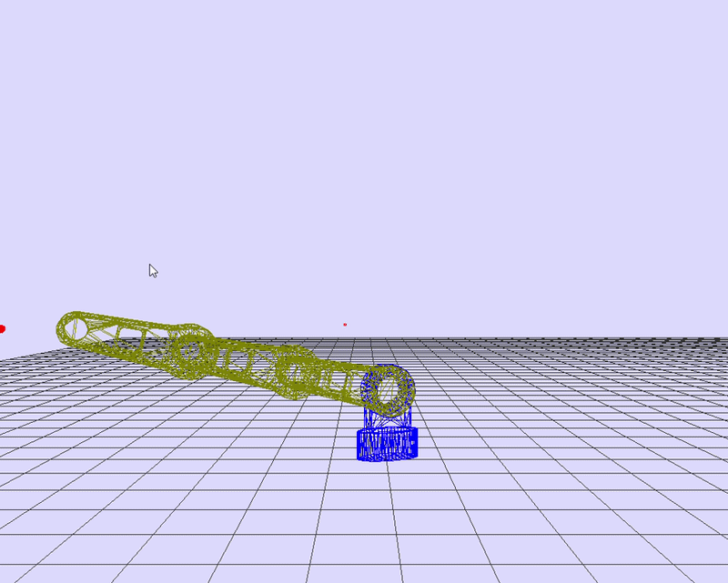

# Robotic Arm Movement Simulation
Simple mechanical simulation of robotic arm.

## Theory of operation
In the future.

## Why?
1. To be an interactive tool and support tutorials.
2. To interact with the controller during development (Software In The Loop). This eliminates the needs for any hardware during early stages of controller develop.

## What does it simulate / demonstrate
- Movement of robotic with three sections in 3D space.
- Robot arm will follow mouse position (red sphere).

### Demonstration

## Future plans
- Add gripper.
- Demonstrate closed-loop controlers.

Requires Python to run the example code (inclues dedicated unit-test). For visual support install pyGame and GSOF_3dWireFrame.

http://python.org/

http://www.pygame.org

https://github.com/mrGSOF/GSOF_3dWireFrame

## Running instructions
- Install requirements `pip install -r requirements.txt`
- or install from PIP with `pip install GSOF_3dWireFrame`
- or clone and install GSOF_3dWireFrame (`pip install GSOF_3dWireFrame.` or `setup.bat`)
- Clone roboticArmSim project.
- run `python Example_RoboticArm.py`

Interactive operation is supported using the mouse.
